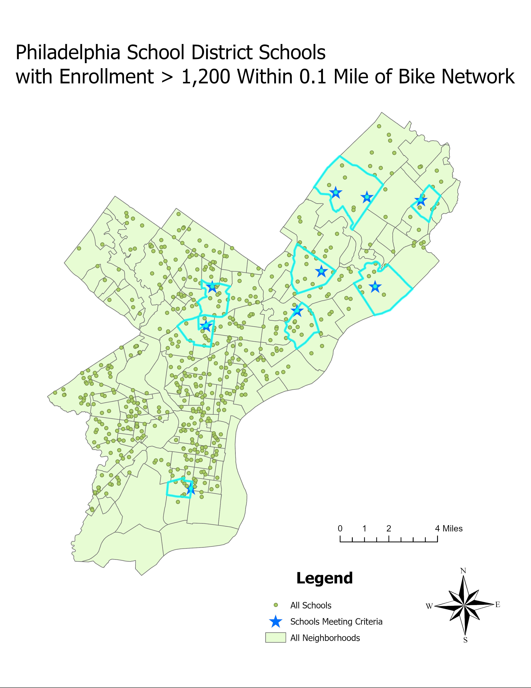
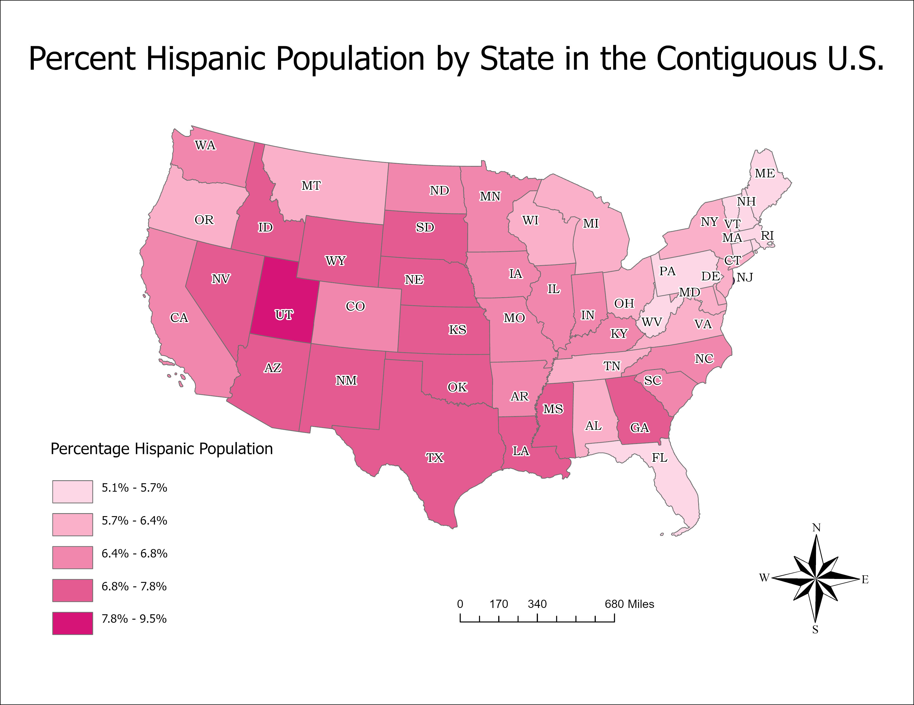

🌿 Saaz's GIS Portfolio

Welcome! This portfolio showcases selected GIS projects I completed during Summer I 2026.

Throughout this semester, I used GIS to map valuable information related to, community accessibility, demographic data, and environmental health. Each project combines geographic analysis with real-world problem solving and reflects the skills I developed in ArcGIS Pro.

Skills Developed

* Spatial Analysis
* Digital Cartographic Design
* Environmental Risk Assessment
* Data Visualization

---

*"Maps are not merely tools for navigation—they are ways of understanding relationships between people, places, and environments."*

---

🚲 Here is where I began; a map outlining Philadelphia schools with the highest rates of student enrollment that are likewise close to the city's expansive and accesible bike network:

🗽 I made another map not too long after, illustrating Hispanic-American population density throughout the Contiguous United States of America:

☠️ And my final map displays areas that are at the highest of risks for toxic (lead polluted) water exposure in Michigan:

