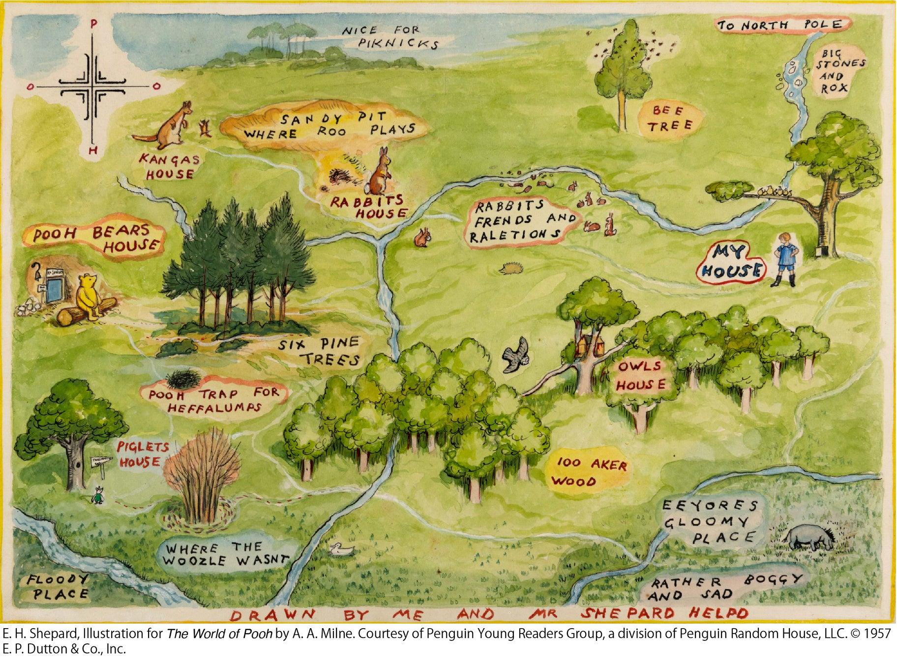
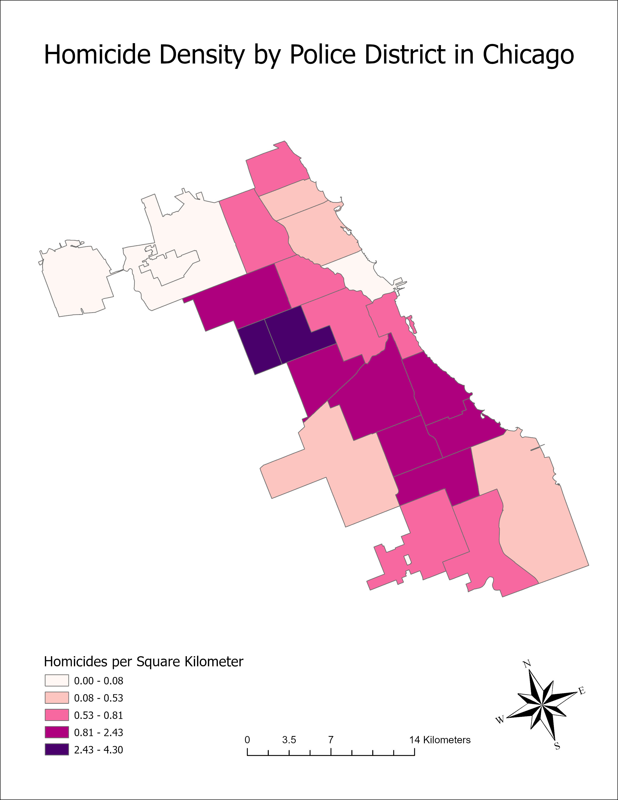

# 🗺️ Saaz's GIS Portfolio

Welcome! 👋 I'm Saaz, an Environmental Studies student at Temple University. I am passionate about and currently researching new sustainability and environmental justice frameworks through collectivist urban & community planning (via original habitable land art proposals). The following portfolio showcases 3 GIS projects I completed in my Fundamentals of GIS course. 

Here, several projects are highlighted that demonstrate how digital mapping can be used to help audience members more easily and visually comprehend demographic patterns, public safety concerns, and environmental health risks. Each project combines geographic analysis with real-world problem solving, while reflecting the skills I developed in ArcGIS Pro.

## Overall Skills Developed:
 
* Introductory Digital Cartographic Design
* Introductory Spatial Analysis

## 📍 Featured Projects:

1. Hispanic Population Distribution in the United States
2. Homicide Density by Police District in Chicago
3. Environmental Risk Assessment of Toxic Water Exposure in Flint, Michigan

---
### 🤝 *Maps are not merely tools for navigation—they are ways of understanding relationships between everyone, everything, spanning across every environment.* 🍯

---

# 🗃️ ✧･ﾟ: *✧･ﾟ:* GIS Portfolio *:･ﾟ✧*:･ﾟ✧ 📂

## 🗽 One of my first maps illustrates Hispanic-American population density throughout each U.S. state:

This project examined the spatial distribution of Hispanic populations throughout the contiguous United States. The goal was to identify geographic patterns and determine which states contained the largest Hispanic populations. By visualizing demographic data through proportional symbols, population differences became easier to compare across regions. The analysis revealed strong concentrations in states such as California, Texas, and Florida, while many northern states exhibited much smaller populations. This project demonstrated how GIS can transform demographic data into a visual narrative that supports population analysis and decision-making.

### GIS Skills Used:

* Joining demographic data to spatial boundaries
* Graduated symbol mapping
* Symbology design
* Cartographic layout design

## 🪦 Another map exhibits the homicide density in the city of Chicago:

This project analyzed homicide density across Chicago police districts. The objective was to identify spatial patterns in violent crime and determine which districts experienced the highest homicide concentrations. By organizing homicide counts and displaying them through a choropleth map, areas of elevated risk became immediately visible. The resulting map highlighted several districts with substantially higher homicide densities than surrounding areas. This analysis demonstrates how GIS can be used to support public safety planning and resource allocation.

### GIS Skills Used:

* Density calculations
* Choropleth mapping
* Classification methods
* Cartographic layout design

## ☠️ And my final map displays areas that are at the highest of risks for toxic (lead polluted) water exposure in Michigan:

This project identified areas in Flint, Michigan that face the greatest risk of exposure to contaminated drinking water. Three environmental risk factors were incorporated: proximity to toxic release facilities discharging more than 10,000 tons of water pollutants, proximity to rivers, and proximity to lead service lines. The resulting map highlights neighborhoods where residents may face elevated environmental health risks. This project demonstrates how GIS can support environmental justice and public health investigations.

### GIS Skills Used:

* Attribute table joins
* Coordinate system management
* Dissolve operations
* Environmental risk modeling
* Cartographic layout design

---

# 🌱 Looking Ahead

*Thank you for taking the time to explore my introductory GIS portfolio. These projects represent the beginning of my journey into spatial analysis and cartographic storytelling. As I continue studying Environmental Studies at Temple University and progress my original research, I look forward to expanding this repository with more advanced GIS projects focused on sustainability, environmental justice, and community-centered planning.*

*I hope each new map continues to deepen my understanding of the relationships between everyone, everything, and every environment we share.*
